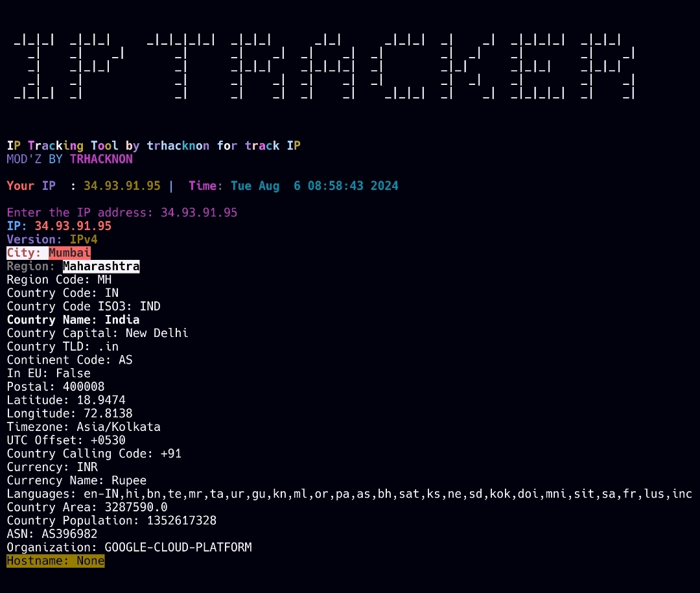

# ip

## Développeur: trhacknon

Bienvenue dans le projet `ip`. Ce projet a été conçu pour [ip tracking].

### Installation




```
pkg install git
pkg install python-pip
pkg install python3
```

1. Clonez le dépôt :
   ```bash
   git clone https://github.com/tucommenceapousser/ip
   ```

2. Accédez au répertoire du projet :
   ```bash
   cd ip
   ```

3. Installez les dépendances requises :
   ```bash
   pip install -r sigma.txt
   ```

### Utilisation

Pour exécuter le script principal, utilisez la commande suivante :
```bash
python3 ip.py
```
